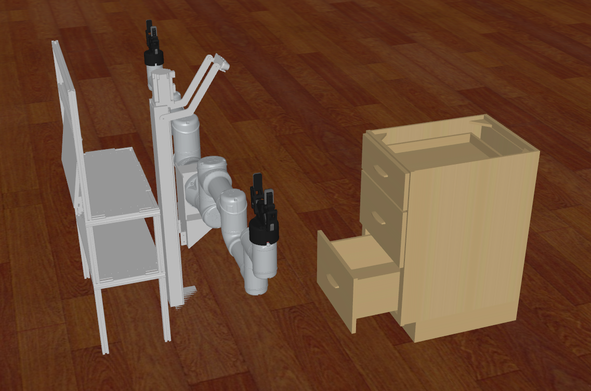

# Cap SimCloseCabinetDrawer Data

## 获取数据
    python record_sim_episodes.py --task_name sim_close_cabinet_top_drawer --onscreen_render
其中 ‘top’ 可换为middle bottom以采对应的数据。

## Cabinet位置变化范围
    x_range = [0.78, 0.88]
    y_range = [-0.53, -0.33]
    z_range = [0.32, 0.32]
在一个10*20cm的范围内随机生成柜子。柜子抽屉的开合程度是0.15，bottom的开合程度是0.12，单位米/m

## 任务成功评价标准
每次演示中柜子的最后一帧的joint开合程度小于0.015m为成功，反之任务失败。

## 训练视角head的位置
		<camera name="head" fovy="78" mode="fixed" euler="0.0 -0.4 -1.57" pos="0.38 -0.4 1.05"/>

## 场景视图
