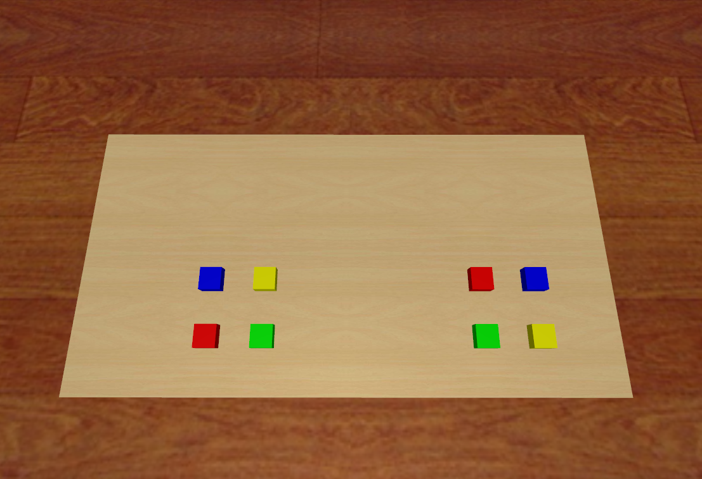

# Cap SimPickColoredBlocks Data

## 获取数据
    python record_sim_episodes.py --task_name sim_pick_the_left_red_block --onscreen_render
其中 `--task_name` 可换为:
`--task_name sim_pick_the_right_red_block
`
`--task_name sim_pick_the_right_yellow_block
`
`--task_name sim_pick_the_right_blue_block
`
`--task_name sim_pick_the_right_green_block
`
`--task_name sim_pick_the_left_red_block
`
`--task_name sim_pick_the_left_yellow_boxblock
`
`--task_name sim_pick_the_left_blue_block
`
`--task_name sim_pick_the_left_green_block
`
## 四个物块中心位置变化范围
`def SampleRightBoxCenterPosition():
    x_range = [0.4, 0.50]
    y_range = [-0.3, -0.2]
    z_range = [0.08, 0.08]`

`def SampleLeftBoxCenterPosition():
    x_range = [0.4, 0.50]
    y_range = [0.2, 0.3]
    z_range = [0.08, 0.08]`

在一个5*7.5cm的范围内随机生成柜子。柜子抽屉的开合程度是0.15，bottom的开合程度是0.12，单位米/m

## 任务成功评价标准
每次演示中的最后一帧夹爪与对应的物块有接触为成功，反之任务失败。

## 训练视角head的位置
		<camera name="front" pos="0.9 0 0.9" resolution="640 480" fovy="78" mode="fixed" euler="0 0.785 1.57"/>

## 场景视图
