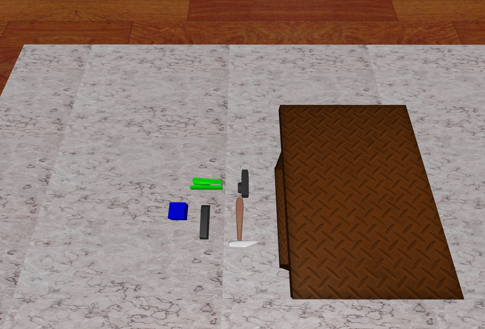

# Cap PutStuff2Pan Data

## 获取数据
    python record_sim_episodes.py --task_name sim_put_duck_to_pan --onscreen_render
其中 `--task_name` 可换为:
`--task_name sim_put_apple_to_pan
`
`--task_name sim_put_duck_to_pan
`
`--task_name sim_put_pig_to_pan
`
`--task_name sim_put_teapot_to_pan
`
## 四个物块中心位置变化范围
`def SampleLeftBoxCenterPosition():
    x_range = [0.4, 0.5]
    y_range = [0.15, 0.25]
    z_range = [0.08, 0.08]`

    ranges = np.vstack([x_range, y_range, z_range])
    cube_position = np.random.uniform(ranges[:, 0], ranges[:, 1])

    cube_quat = np.array([1, 0, 0, 0])
    return np.concatenate([cube_position, cube_quat])

`def SamplePanPose():
    x_range = [0.4, 0.5]
    # x_range = [0.78, 0.88]
    y_range = [-0.05, 0.05]
    # y_range = [0.2, 0.25]
    z_range = [0.08, 0.08]
`
    ranges = np.vstack([x_range, y_range, z_range])
    cabinet_position = np.random.uniform(ranges[:, 0], ranges[:, 1])

    PanQuat = np.array([0, 0, 0, 1])
    return np.concatenate([cabinet_position, PanQuat])

在一个10*10cm的范围内随机生成pan。柜子抽屉的开合程度是0.2/0.15，bottom的开合程度是0.2，单位米/m

## 任务成功评价标准
当stuff与抽屉底部接触则成功，反之任务失败。

## 训练视角head的位置
		<camera name="head" fovy="78" mode="fixed" euler="0.0 -0.4 -1.57" pos="0.3 -0 1.05"/>

## 场景视图

## 注意事项
其中苹果的抓取动作容易使得苹果滚动，所以其抓去成功很看运气，
所以做实验的时候可以不做这个数据。
