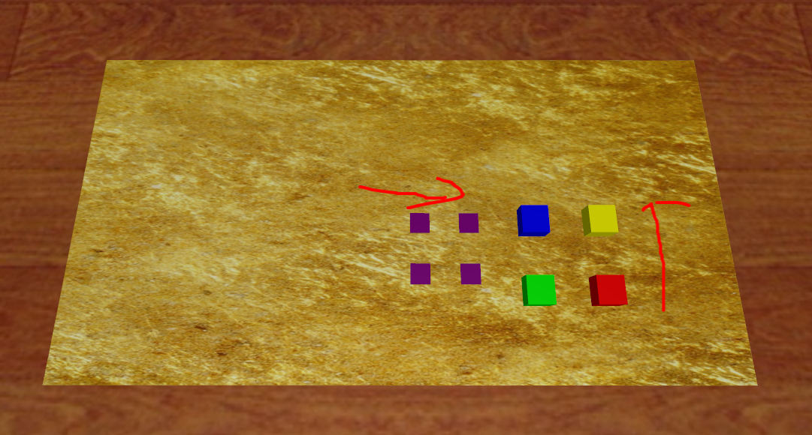

# Cap SimBoxCoverMarker Data
16个子任务
## 获取数据
    python record_sim_episodes.py --task_name sim_green_box_cover_bottom_left_marker --onscreen_render
其中 `--task_name` 可换为:
`--task_name constants.py`里面的16个中的任何一个

## 四个物块中心位置变化范围
`def SampleRightBoxCenterPosition():
    x_range = [0.40, 0.45]
    # x_range = [0.40, 0.45]
    y_range = [-0.33, -0.23]
    # y_range = [-0.33, -0.23]
    z_range = [0.08, 0.08]
    ranges = np.vstack([x_range, y_range, z_range])
    cube_position = np.random.uniform(ranges[:, 0], ranges[:, 1])
    cube_quat = np.array([1, 0, 0, 0])
    return np.concatenate([cube_position, cube_quat])`
`
def SampleMarkerCenter():
    x_range = [0.42, 0.47]
    # 小于0.42需要修改np.array([0.01, 0.0, 0.3])为np.array([0.0, 0.0, 0.3])
    # x_range = [0.42, 0.47]
    y_range = [-0.11, -0.01]
    # y_range = [-0.11, -0.01]
    z_range = [0.06, 0.06]
    ranges = np.vstack([x_range, y_range, z_range])
    cabinet_position = np.random.uniform(ranges[:, 0], ranges[:, 1])
    cabinet_quat = np.array([1, 0, 0, 0])
    return np.concatenate([cabinet_position, cabinet_quat])`

在一个5*7.5cm的范围内随机生成柜子。柜子抽屉的开合程度是0.15，bottom的开合程度是0.12，单位米/m

## 任务成功评价标准
每次演示中的最后一帧夹爪与对应的物块有接触为成功，反之任务失败。

## 训练视角head的位置
		<camera name="front" pos="0.9 0 0.9" resolution="640 480" fovy="78" mode="fixed" euler="0 0.785 1.57"/>

## 场景视图

